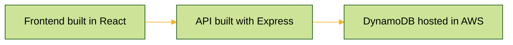

# MovieApp

This is a simple movie listing application built with React and TypeScript. The app ultises Webpack for bundling of the JS/TS artifacts.
It has a common three-tiered architecture as illustruted by the below diagram.



## Directory Structure

```
.
├── .gitignore
├── backend/
│   ├── db.ts
│   ├── models/
│   │   └── Movie.ts
│   ├── package.json
│   ├── routes/
│   │   └── default.ts
│   ├── server.js
│   └── tsconfig.json
├── frontend/
│   ├── components/
│   │   └── MovieList.tsx
│   ├── package.json
│   ├── public/
│   │   ├── index.html
│   │   └── index.tsx
│   └── tsconfig.json
│   └── webpack.config.js
├── instance_config.json
├── manifest.yml
├── package.json
└── README.md
```

## Set up Docker desktop, Dynamo, and AWS CLI for locally running

If your testing the application locally you'll need to setup a local DynamoDB container to store the movie data. 
To run the container you'll first need to install [Docker Desktop](https://www.docker.com/products/docker-desktop/). 
Once that is installed pull the [DynamoDB image](https://hub.docker.com/r/amazon/dynamodb-local) from Docker Hub. This is command to pull the image:

```sh
docker pull amazon/dynamodb-local
```

Then simply run the image: 

```sh
docker run -p 8000:8000 amazon/dynamodb-local
```

To interact with Dynamo, the AWS CLI tool will come in handy. Instructions for installation can be found [here](https://docs.aws.amazon.com/cli/latest/userguide/getting-started-install.html).
You will need to configure the credentials for the CLI. Do this with the following:

```sh
aws configure
```

Since the CLI tool is used to interact with a local DB instance you can set dummy credientials.
For example:
AWS Access Key ID [None]: dummy
AWS Secret Access Key [None]: dummy
Default region name [None]: us-west-2
Default output format [None]: json

With the AWS CLI tool installed and configured, you'll want to use it to create the 'Movies' table in the DB. Do this with the following command:

```sh
aws dynamodb create-table --table-name Movies --attribute-definitions AttributeName=id,AttributeType=S --key-schema AttributeName=id,KeyType=HASH --provisioned-throughput ReadCapacityUnits=5,WriteCapacityUnits=5 --region us-west-2 --endpoint-url http://localhost:8000 
```

You can view the newly created 'Movies' table via the command:

```sh
aws dynamodb scan --table-name Movies --endpoint-url http://localhost:8000
```


## Running Locally

To run this project locally, you'll need to have Node.js and npm installed on your machine. Both the frontend and backend code are housed in this repository. 

Follow these steps:

1. **Clone the repository**:

    ```sh
    git clone https://github.com/LiamRussellNZ/movieApp.git
    ```

2. **Navigate into the project frontend directory and build components**:

    ```sh
    cd movieapp/frontend
    npm run build
    ```

3. **Navigate to the backend folder and then run**:

    ```sh
    cd ../backend
    npm run start
    ```

The application should now be running at `http://localhost:8080`.

## Swagger (AKA Open-API) spec

Included in this project is an Open-API definition. This documentation can be accessed by appending /api-docs to the base url. For example if you've a local app server running you would access the Open-API spec at `http://localhost:8080/api-docs/`