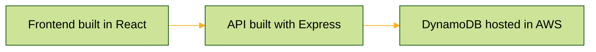

# MovieApp

This is a simple movie listing application built with React and TypeScript. The app ultises Webpack for bundling of the JS/TS artifacts.
It has a common three-tiered architecture as illustruted by the below diagram.



## Directory Structure

```
.
├── .gitignore
├── backend/
│   ├── db.ts
│   ├── models/
│   │   └── Movie.ts
│   ├── package.json
│   ├── routes/
│   │   └── default.ts
│   ├── server.js
│   └── tsconfig.json
├── documentation/
│   ├── apiQueries/
│   │   └── get_movies.md
│   └── database/
│       ├── postgres_setUp.md
│       └── postgress_setTable_insertValues.md
├── frontend/
│   ├── components/
│   │   └── MovieList.tsx
│   ├── package.json
│   ├── public/
│   │   ├── index.html
│   │   └── index.tsx
│   └── tsconfig.json
│   └── webpack.config.js
├── instance_config.json
├── manifest.yml
├── package.json
└── README.md
```

## Running Locally

To run this project locally, you'll need to have Node.js and npm installed on your machine. Both the frontend and backend code are housed in this repository. 

Follow these steps:

1. **Clone the repository** to your local machine:

    ```sh
    git clone https://github.com/LiamRussellNZ/movieApp.git
    ```

2. **Navigate into the project frontend directory**:

    ```sh
    cd movieapp/frontend
    ```

3. **Compile and Build the frondend components**:

    ```sh  
    tsc
    npm run build
    ```

4. **Start the server**:

    Navigate to the backend folder and then run:

    ```sh
    cd ../backend
    npm run start
    ```

The application should now be running at `http://localhost:8080`.
