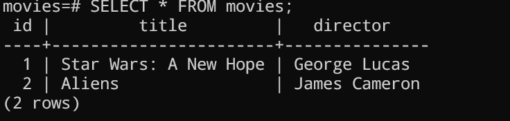

Once you have connected to the `movies` database, follow the below to create the table with an initial schema and inject some values into it.

This will create the `movies` table:
```sh
CREATE TABLE movies (
 id SERIAL PRIMARY KEY,
 title VARCHAR(100),
 director VARCHAR(100)
);
```
Once that is created we can insert some initial values:

```sh
INSERT INTO movies (title, director) VALUES ('Star Wars: A New Hope', 'George Lucas');
INSERT INTO movies (title, director) VALUES ('Aliens', 'James Cameron');
```

Once you've popluated the table with some intial values to see them enter:
```sh
SELECT * FROM movies;
```

If all is well you should see the following in your terminal:
